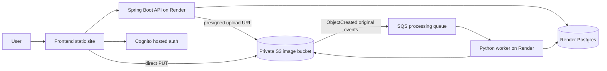

# ClosetHop

ClosetHop is a wardrobe management app with a React frontend, a Spring Boot API,
and a Python image-processing worker.

## Architecture

Production runs the application stack on Render, with AWS still handling auth,
storage, and async processing.



Image uploads go directly from the browser to a private S3 bucket using
presigned URLs issued by Spring. S3 ObjectCreated notifications push original
image work to SQS, and the Python worker atomically claims rows in Postgres,
processes images, detects duplicates, and writes final item state directly.

See [`docs/architecture.md`](docs/architecture.md) for the detailed upload
state diagram, failure flows, and cleanup jobs.

## Project Layout

- `frontend/` React + TypeScript UI
- `backend/` Spring Boot HTTP API
- `worker/` Python SQS image-processing worker
- `render.yaml` Render blueprint for the API, worker, and Postgres services

## Prerequisites

- Node.js 20+
- Java 17+
- Docker and Docker Compose
- `npm`

## Production Deployment

### Render services

The active deployment path on `main` uses:

- Render `web` service for the Spring Boot API
- Render `worker` service for the Python image processor
- Render Postgres for the application database
- AWS S3 for image storage
- AWS SQS for async image processing
- AWS Cognito for authentication

The repository root includes [`render.yaml`](render.yaml), which defines the
Render blueprint for the backend services.

### AWS prerequisites

You still need an AWS account with:

- S3 for image storage
- SQS for image processing events
- Cognito for auth

You also need runtime values for:

- `AWS_S3_BUCKET`
- `PROCESSING_QUEUE_URL`
- `COGNITO_ISSUER`
- `COGNITO_CLIENT_ID`
- `GEMINI_API_KEY`
- `AWS_ACCESS_KEY_ID`
- `AWS_SECRET_ACCESS_KEY`

### Render API, worker, and database

1. Create a new Render Blueprint from [`render.yaml`](render.yaml).
2. Let Render provision:
   - `closethop-api`
   - `closethop-worker`
   - `closethop-postgres`
3. When prompted for `sync: false` values, set:
   - `AWS_S3_BUCKET`
   - `COGNITO_ISSUER`
   - `COGNITO_CLIENT_ID`
   - `CORS_ALLOWED_ORIGINS`
   - `GEMINI_API_KEY`
   - `AWS_ACCESS_KEY_ID`
   - `AWS_SECRET_ACCESS_KEY`
   - `IMAGE_BUCKET`
   - `PROCESSING_QUEUE_URL`

Deployment notes:

- `backend/Dockerfile` accepts Render-style Postgres URLs and normalizes them
  for Spring Boot at startup.
- The current setup is intended to start with one API instance and one worker
  instance.
- Free Render plans are fine for validation, but not for durable production.

### Frontend hosting

Deploy `frontend/` as a static site. If you are also hosting the frontend on
Render, create a Static Site pointing at `frontend/` with:

- Build command: `npm install && npm run build`
- Publish directory: `dist`

Set these production environment variables for the frontend:

```dotenv
VITE_API_BASE_URL=https://closethop-api.onrender.com
VITE_AUTH_MODE=cognito
VITE_COGNITO_USER_POOL_ID=us-east-1_example
VITE_COGNITO_CLIENT_ID=exampleclientid
VITE_COGNITO_DOMAIN=closethop-dev-123456789012.auth.us-east-1.amazoncognito.com
VITE_COGNITO_REDIRECT_SIGN_IN=https://app.example.com/auth/callback
VITE_COGNITO_REDIRECT_SIGN_OUT=https://app.example.com
```

Set backend `CORS_ALLOWED_ORIGINS` to the frontend origin.

## Start Locally

In local development, the app uses Compose-managed Postgres and LocalStack for
S3 and SQS so the full upload pipeline can run without AWS.

1. Start LocalStack, Postgres, and the Python image worker from the backend
   compose file:

   ```bash
   cd backend
   cp .env.example .env
   docker compose up --build
   ```

2. Start the Spring Boot API in a second terminal:

   ```bash
   cd backend
   ./mvnw spring-boot:run -Dspring-boot.run.profiles=local
   ```

3. Optional: if you do not use Docker Compose for the worker, start the Python
   worker manually in a third terminal:

   ```bash
   cd worker
   pip install -r requirements-dev.txt
   AWS_ACCESS_KEY_ID=dummy \
   AWS_SECRET_ACCESS_KEY=dummy \
   AWS_DEFAULT_REGION=us-east-1 \
   AWS_ENDPOINT_URL=http://localhost:4566 \
   DATASOURCE_URL=jdbc:postgresql://localhost:5432/closethop \
   DATASOURCE_USERNAME=closethop \
   DATASOURCE_PASSWORD=closethop \
   IMAGE_BUCKET=closethop-images \
   PROCESSING_QUEUE_URL=http://localhost:4566/000000000000/closethop-image-processing \
   PUBLIC_URL=http://localhost:4566/closethop-images \
   VISION_PROVIDER=fake \
   METRICS_ENABLED=false \
   gunicorn --bind 0.0.0.0:8080 --workers 1 --timeout 180 app:http_app
   ```

4. Start the frontend in another terminal:

   ```bash
   cd frontend
   cp .env.example .env
   npm install
   npm run dev
   ```

5. Open `http://localhost:3000`.

### Local flow

- The frontend talks to the API at `http://localhost:8080` by default.
- Local development uses Postgres from Docker Compose.
- LocalStack provides local S3 and SQS emulation.
- The frontend requests a presigned upload URL from Spring, uploads the image
  directly to S3, then polls Spring for item status.
- The Python worker long-polls the LocalStack SQS queue and updates Postgres
  directly after processing.

### Local verification

Open `http://localhost:3000`, create a local account, and add an item. It
should move from `WAITING_FOR_UPLOAD` to `PROCESSING` to `READY` after the
Python worker handles the S3 event.

## Useful Commands

Frontend:

```bash
cd frontend
npm test
npm run build
```

Local Compose service logs:

```bash
cd backend
docker compose logs -f localstack postgres
```

Manual backend commands:

```bash
cd backend
./mvnw spring-boot:run -Dspring-boot.run.profiles=local
```

LocalStack inspection:

```bash
cd backend
docker compose exec localstack awslocal s3 ls s3://closethop-images --recursive
```

## Authentication Modes

The frontend supports local auth by default and Cognito in production.

For Cognito mode, set `VITE_AUTH_MODE=cognito` in `frontend/.env` and provide:

- `VITE_COGNITO_USER_POOL_ID`
- `VITE_COGNITO_CLIENT_ID`
- `VITE_COGNITO_DOMAIN`
- Cognito callback and logout URLs if they differ from the localhost defaults

The Cognito user pool must allow the `USER_AUTH` flow and email OTP. Google
sign-in also requires the client configuration and Cognito
`/oauth2/idpresponse` callback.

## Configuration Notes

- `frontend/.env.example` controls the API base URL and auth mode.
- `backend/.env.example` is used by the backend LocalStack/Postgres compose
  setup.
- The backend can also run against PostgreSQL and Cognito in production via the
  values documented in `backend/.env.example`.
- Production runs separate API and Python worker containers. The Python worker
  consumes the SQS processing queue, performs image processing and metadata
  extraction, and updates Postgres directly.
