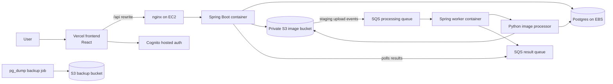

# ClosetHop

ClosetHop is a wardrobe management app with a React frontend, a Spring Boot API,
and dedicated background workers.

## Architecture

Production splits responsibilities between a Vercel-hosted frontend, an EC2
app host running Docker Compose, and managed AWS services for auth, storage,
queues, async processing, and backups.



Production request flow starts in Vercel, where `/api/*` is rewritten to nginx
on a single EC2 instance. nginx proxies requests to the Spring Boot container,
which uses a Postgres container persisted on EBS.

Image uploads land in a private S3 bucket under a staging prefix. S3 event
notifications push work to SQS, a Spring worker container claims the job and
delegates image processing to a private Python HTTP service, and the backend
polls the result queue to finalize wardrobe state. A scheduled backup job
writes Postgres dumps to a separate S3 backup bucket.


## Project Layout

- `frontend/` React + TypeScript UI
- `backend/` multi-module Spring Boot build
  - `backend/api/` HTTP API
  - `backend/shared/` shared DTOs and configuration properties
  - `backend/worker/` SQS worker
- `worker/` Python image-processing service used by the Spring worker
- `infrastructure/` AWS CDK infrastructure for production
- `deploy/ec2/` EC2 deployment configuration, including the production app stack
  in [`deploy/ec2/compose.prod.yml`](deploy/ec2/compose.prod.yml)

## Prerequisites

- Node.js 20+
- Java 17+
- Docker and Docker Compose
- `npm`

## Production Deployment

### AWS prerequisites

1. Configure an AWS account and bootstrap the target account/region with CDK.
2. Create Google OAuth web credentials.
3. Create the OAuth and Gemini secrets expected by the stack:

   ```bash
   aws secretsmanager create-secret \
     --name closethop/dev/google-oauth \
     --secret-string '{"clientId":"GOOGLE_CLIENT_ID","clientSecret":"GOOGLE_CLIENT_SECRET"}'

   aws secretsmanager create-secret \
     --name closethop/dev/gemini \
     --secret-string '{"apiKey":"GEMINI_API_KEY"}'
   ```

After the first deployment, add the `GoogleOAuthCallbackUrl` stack output to
the authorized redirect URIs in Google Cloud Console.

### Validate and synthesize infrastructure

```bash
cd infrastructure
npm install
npm test
npm run build
npm run synth
```

Override configuration with CDK context:

```bash
cd infrastructure
npx cdk synth \
  -c callbackUrl=https://app.example.com/auth/callback \
  -c logoutUrl=https://app.example.com \
  -c googleSecretName=closethop/dev/google-oauth \
  -c geminiSecretName=closethop/dev/gemini \
  -c alertEmail=alerts@example.com
```

`alertEmail` is optional. When provided, the stack creates an SNS topic,
subscribes the email address, and routes CloudWatch alarm notifications to it.
The subscription remains pending until the recipient confirms the AWS email.

### EC2 deployment

The EC2 instance is reachable through AWS Systems Manager Session Manager; SSH
is not opened by the stack. After CDK deploy finishes, connect to the instance
and install the app:

```bash
sudo mkdir -p /opt/closethop
sudo chown ec2-user:ec2-user /opt/closethop
cd /opt/closethop
git clone https://github.com/YOUR_ORG/YOUR_REPO.git repo
cd repo/deploy/ec2
cp .env.example .env
```

Edit `.env` using stack outputs:

- `AWS_S3_BUCKET` from `ImageBucketName`
- `BACKUP_BUCKET` from `DatabaseBackupBucketName`
- `PROCESSING_QUEUE_URL` from `ProcessingQueueUrl`
- `PROCESSING_RESULT_QUEUE_URL` from `ProcessingResultQueueUrl`
- `COGNITO_ISSUER` from `CognitoIssuer`
- `COGNITO_CLIENT_ID` from `UserPoolClientId`
- `CORS_ALLOWED_ORIGINS` set to the Vercel app origin
- `POSTGRES_PASSWORD` set to a long random value
- `GEMINI_API_KEY` set to the Gemini API key used by the backend outfit AI

Start the production Compose stack:

```bash
docker compose --env-file .env -f compose.prod.yml up -d --build
docker compose --env-file .env -f compose.prod.yml ps
curl http://localhost/health
```

The nginx container listens on ports 80 and 443. It creates a short-lived
self-signed certificate on first boot so 443 is available immediately. Replace
`deploy/ec2/certs/fullchain.pem` and `deploy/ec2/certs/privkey.pem` with
Let's Encrypt or managed proxy certificates before treating HTTPS as production
trusted.

### Backups and restore

Install the nightly Postgres backup cron:

```bash
cd deploy/ec2
chmod +x install-backup-cron.sh
./install-backup-cron.sh
```

Run a manual backup:

```bash
cd deploy/ec2
docker compose --env-file .env -f compose.prod.yml --profile backup run --rm backup
```

Restore a backup:

```bash
aws s3 cp s3://$BACKUP_BUCKET/postgres/closethop-YYYYMMDDTHHMMSSZ.dump /data/closethop/backups/restore.dump
docker compose --env-file .env -f compose.prod.yml exec postgres \
  pg_restore --clean --if-exists --no-owner \
  --username "$POSTGRES_USER" \
  --dbname "$POSTGRES_DB" \
  /backups/restore.dump
```

### Vercel configuration

Set these production environment variables in Vercel:

```dotenv
API_ORIGIN=http://EC2_PUBLIC_DNS_NAME
VITE_API_BASE_URL=/
VITE_AUTH_MODE=cognito
VITE_COGNITO_USER_POOL_ID=us-east-1_example
VITE_COGNITO_CLIENT_ID=exampleclientid
VITE_COGNITO_DOMAIN=closethop-dev-123456789012.auth.us-east-1.amazoncognito.com
VITE_COGNITO_REDIRECT_SIGN_IN=https://app.example.com/auth/callback
VITE_COGNITO_REDIRECT_SIGN_OUT=https://app.example.com
```

`frontend/vercel.json` sends `/api/*` to the EC2 nginx origin first and falls
back to `index.html` for client-side routes.


## Start Locally
In local development, the app uses H2 for the backend database and LocalStack for S3 and SQS so the full upload pipeline can run without AWS.


1. Start LocalStack, the Python image processor, and the Spring worker from the
   backend compose file:

   ```bash
   cd backend
   cp .env.example .env
   docker compose up --build
   ```

2. Start the Spring Boot API in a second terminal:

   ```bash
   cd backend
   ./mvnw -pl api -am install -DskipTests
   ./mvnw -f api/pom.xml spring-boot:run -Dspring-boot.run.profiles=local
   ```

   The first command installs the shared module into your local Maven cache.
   The second command runs the actual API module instead of the parent
   aggregator project.

3. Optional: start the Spring worker manually in a third terminal if you are
   not using the Docker Compose worker:

   ```bash
   cd backend
   ./mvnw -pl worker -am install -DskipTests
   ./mvnw -f worker/pom.xml spring-boot:run
   ```

   If you also skip the Compose-managed Python service, run it separately:

   ```bash
   cd worker
   pip install -r requirements-dev.txt
   AWS_ACCESS_KEY_ID=dummy \
   AWS_SECRET_ACCESS_KEY=dummy \
   AWS_DEFAULT_REGION=us-east-1 \
   AWS_ENDPOINT_URL=http://localhost:4566 \
   IMAGE_BUCKET=closethop-images \
   PUBLIC_URL=http://localhost:4566/closethop-images \
   VISION_PROVIDER=fake \
   METRICS_ENABLED=false \
   gunicorn --bind 0.0.0.0:8080 --workers 1 --timeout 180 app:http_app
   ```

4. Start the frontend in another terminal:

   ```bash
   cd frontend
   cp .env.example .env
   npm install
   npm run dev
   ```

5. Open `http://localhost:3000`.

### Local flow

- The frontend talks to the API at `http://localhost:8080` by default.
- Local development uses H2 data stored under `backend/data/`.
- LocalStack provides local S3 and SQS emulation.
- The Docker Compose Python image processor listens on `http://localhost:8080`
  inside the Compose network.
- The Docker Compose Spring worker listens on `http://localhost:8081` and
  long-polls the LocalStack SQS queue.
- The API still polls the result queue and finalizes clothing item state.

### Local verification

Open `http://localhost:3000`, create a local account, and add an item. It
should move from `PROCESSING` to `READY` after the worker publishes a result.

## Useful Commands

Frontend:

```bash
cd frontend
npm test
npm run build
```

Backend, worker, and image-processor logs:

```bash
cd backend
docker compose logs -f worker image-processor
```

Manual backend commands:

```bash
cd backend
./mvnw -pl api -am install -DskipTests
./mvnw -f api/pom.xml spring-boot:run -Dspring-boot.run.profiles=local
./mvnw -pl worker -am install -DskipTests
./mvnw -f worker/pom.xml spring-boot:run
```

LocalStack inspection:

```bash
cd backend
docker compose exec localstack awslocal sqs list-queues
docker compose exec localstack awslocal dynamodb scan --table-name wardrobe-vision-metadata-cache
docker compose exec localstack awslocal s3 ls s3://closethop-images --recursive
```

Infrastructure validation:

```bash
cd infrastructure
npm test
npm run build
npm run synth
```

## Authentication Modes

The frontend supports local auth by default and Cognito in production.

For Cognito mode, copy the CDK stack outputs into `frontend/.env`, set
`VITE_AUTH_MODE=cognito`, and provide:

- `VITE_COGNITO_USER_POOL_ID`
- `VITE_COGNITO_CLIENT_ID`
- `VITE_COGNITO_DOMAIN`
- Cognito callback and logout URLs if they differ from the localhost defaults

The Cognito user pool must allow the `USER_AUTH` flow and email OTP. Google
sign-in also requires the client configuration and Cognito
`/oauth2/idpresponse` callback described in the production deployment section.

## Configuration Notes

- `frontend/.env.example` controls the API base URL and auth mode.
- `backend/.env.example` is used by the LocalStack and worker compose setup.
- The backend can also run against PostgreSQL and Cognito in production via the
  values documented in `backend/.env.example`.
- Production runs separate API, Spring worker, and Python image-processor
  containers. The Spring worker consumes the SQS processing queue, the Python
  service performs image processing and metadata extraction, and the API
  continues polling the result queue.
