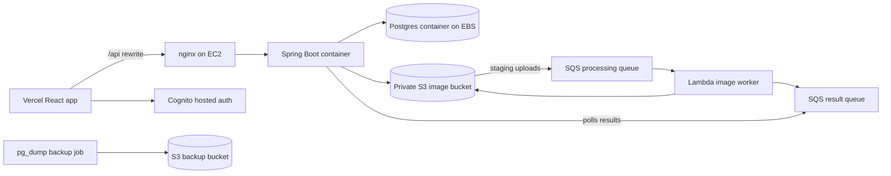

# ClosetHop AWS infrastructure

This CDK app provisions the low-cost production foundation for ClosetHop:



The stack intentionally avoids RDS, ECS, and NAT gateways. One EC2 host runs
Docker Compose with nginx, Spring Boot, and Postgres. AWS still handles the
parts that are strong portfolio signals without dominating the monthly bill:
Cognito auth, private S3 image storage, SQS queues, Lambda image processing,
IAM roles, CloudWatch alarms, and S3 database backups.

## Prerequisites

1. Configure an AWS account and bootstrap the target account/region with CDK.
2. Create Google OAuth web credentials.
3. Create the OAuth and Gemini secrets expected by the stack:

```bash
aws secretsmanager create-secret \
  --name closethop/dev/google-oauth \
  --secret-string '{"clientId":"GOOGLE_CLIENT_ID","clientSecret":"GOOGLE_CLIENT_SECRET"}'

aws secretsmanager create-secret \
  --name closethop/dev/gemini \
  --secret-string '{"apiKey":"GEMINI_API_KEY"}'
```

After the first deployment, add the `GoogleOAuthCallbackUrl` stack output to
the authorized redirect URIs in Google Cloud Console.

## Validate and synthesize

```bash
npm install
npm test
npm run build
npm run synth
```

Override configuration with CDK context:

```bash
npx cdk synth \
  -c callbackUrl=https://app.example.com/auth/callback \
  -c logoutUrl=https://app.example.com \
  -c googleSecretName=closethop/dev/google-oauth \
  -c geminiSecretName=closethop/dev/gemini \
  -c alertEmail=alerts@example.com
```

`alertEmail` is optional. When provided, the stack creates an SNS topic,
subscribes the email address, and routes CloudWatch alarm notifications to it.
The subscription remains pending until the recipient confirms the AWS email.

## EC2 deployment

The EC2 instance is reachable through AWS Systems Manager Session Manager; SSH
is not opened by the stack. After CDK deploy finishes, connect to the instance
and install the app:

```bash
sudo mkdir -p /opt/closethop
sudo chown ec2-user:ec2-user /opt/closethop
cd /opt/closethop
git clone https://github.com/YOUR_ORG/YOUR_REPO.git repo
cd repo/deploy/ec2
cp .env.example .env
```

Edit `.env` using stack outputs:

- `AWS_S3_BUCKET` from `ImageBucketName`
- `BACKUP_BUCKET` from `DatabaseBackupBucketName`
- `PROCESSING_RESULT_QUEUE_URL` from `ProcessingResultQueueUrl`
- `COGNITO_ISSUER` from `CognitoIssuer`
- `COGNITO_CLIENT_ID` from `UserPoolClientId`
- `CORS_ALLOWED_ORIGINS` set to the Vercel app origin
- `POSTGRES_PASSWORD` set to a long random value
- `GEMINI_API_KEY` set to the Gemini API key used by the backend outfit AI

Start the production Compose stack:

```bash
docker compose --env-file .env -f compose.prod.yml up -d --build
docker compose --env-file .env -f compose.prod.yml ps
curl http://localhost/health
```

The nginx container listens on ports 80 and 443. It creates a short-lived
self-signed certificate on first boot so 443 is available immediately. Replace
`deploy/ec2/certs/fullchain.pem` and `deploy/ec2/certs/privkey.pem` with
Let's Encrypt or managed proxy certificates before treating HTTPS as production
trusted.

Install the nightly Postgres backup cron:

```bash
chmod +x install-backup-cron.sh
./install-backup-cron.sh
```

Run a manual backup:

```bash
docker compose --env-file .env -f compose.prod.yml --profile backup run --rm backup
```

Restore a backup:

```bash
aws s3 cp s3://$BACKUP_BUCKET/postgres/closethop-YYYYMMDDTHHMMSSZ.dump /data/closethop/backups/restore.dump
docker compose --env-file .env -f compose.prod.yml exec postgres \
  pg_restore --clean --if-exists --no-owner \
  --username "$POSTGRES_USER" \
  --dbname "$POSTGRES_DB" \
  /backups/restore.dump
```

## Vercel configuration

Set these production environment variables in Vercel:

```dotenv
API_ORIGIN=http://EC2_PUBLIC_DNS_NAME
VITE_API_BASE_URL=/
VITE_AUTH_MODE=cognito
VITE_COGNITO_USER_POOL_ID=us-east-1_example
VITE_COGNITO_CLIENT_ID=exampleclientid
VITE_COGNITO_DOMAIN=closethop-dev-123456789012.auth.us-east-1.amazoncognito.com
VITE_COGNITO_REDIRECT_SIGN_IN=https://app.example.com/auth/callback
VITE_COGNITO_REDIRECT_SIGN_OUT=https://app.example.com
```

`frontend/vercel.json` sends `/api/*` to the EC2 nginx origin first and falls
back to `index.html` for client-side routes.

## Why not RDS/ECS?

RDS and ECS are more managed and closer to a mature production architecture.
For this project, EC2 Docker Compose is the better cost-conscious learning
choice: it demonstrates reverse proxying, container orchestration, IAM instance
roles, Postgres persistence on EBS, S3 backups, Cognito, S3/SQS/Lambda async
processing, CloudWatch alarms, and the operational tradeoffs behind not picking
the most expensive AWS defaults.
